<div align="center">



</div>

# QUAD-UAV

Firmware cho quadcopter: **ESP32** (IMU BNO08x, GPS, nhận RC qua ESP-NOW/NRF24, xuất DShot, telemetry, web dashboard) + **STM32F103C8** (cascade PID, motor mixing).

| Env | Board | Vai trò |
|---|---|---|
| `esp32_drone` | ESP32 | IMU, RC, DShot, telemetry |
| `stm32_drone` | Blue Pill | PID + mixing, nhận RC qua UART từ ESP32 |

```bash
pio run -e esp32_drone
pio run -e stm32_drone
```

`src/RF_Protocol.h` dùng chung với repo **JS-CONTROLER** — sửa một bên phải đồng bộ bên kia.
Repo liên quan: JS-CONTROLER (tay cầm), GCS-STATION (trạm mặt đất / simulator).
